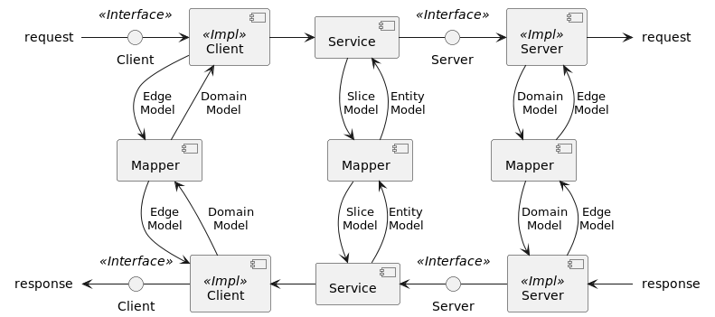

= Решение (Solution)

Система, реализуемая для клиентов.

.Ключевые принципы
****
Множественность окружений и назначений::
Решение используется клиентами в различных окружениях (envs) и для различных назначений (usages). Ключевые окружения/назначения явно выделяются и проверяются в рамках непрерывной интеграции. Устаревшие окружения/назначения снимаются с поддержки.

Тесты! Тесты! Тесты!::
Тестирование - один из важных или даже самый важный аспект разработки! При тестировании проверяется поведение целевого объекта в различных ситуациях. В зависимости от подхода к подготовке зависимостей целевого объекта тесты можно подразделить на 3 категории.
Модульные тесты (unit tests):::
Все зависимости целевого объекта глушатся (stub) или мокируются (mock).
Интеграционные тесты (integration tests):::
Все зависимости глушатся/мокируются кроме одной (иногда нескольких), которая честно конструируется.
Сквозные тесты (end-to-end tests):::
Все зависимости честно конструируются.
****

== Конфигурирование (Configuration)

Читаем конфигурационные параметры (props) в рамках некоторого протокола, отображая их в объекты пограничных моделей.

=== Протоколы (Protocols)

==== FileSystem

Протокол FileSystem

=== Отображения (Mappings)

==== SpringConfig

Подробнее https://docs.spring.io/spring-boot/docs/current/reference/html/features.html#features.external-config

==== LightbendConfig

Подробнее https://lightbend.github.io/config

== Обмен сообщениями (Messaging)

Принимаем/отправляем сообщения (messages) в рамках некоторого протокола, отображая их в объекты пограничных моделей.

=== Протоколы

Wire protocol footnote:[Подробнее https://en.wikipedia.org/wiki/Wire_protocol] - протокол прикладного уровня, который используется для коммуникации между сервером и клиентом.

NOTE: Обычно используются стандартные протоколы, реже - кастомные.

==== HTTP

Протокол HTTP

==== JMX

Протокол JMX

=== Отображения (Mappings)

NOTE: Шаблон проектирования `Message Mapping`.

==== SpringMvc

Подробнее https://docs.spring.io/spring-framework/reference/web/webmvc.html

==== SpringManagement

Подробнее https://docs.spring.io/spring-boot/docs/current/reference/html/actuator.html

== Хранение состояния (Storage)

Запоминаем/вспоминаем состояние (state) в рамках некоторого протокола, отображая его в объекты пограничных моделей.

=== Протоколы (Protocols)

NOTE: Обычно используются кастомные протоколы, реже - стандартные.

==== PostgreSQL

Кастомный протокол PostgreSQL

=== Отображения (Mappings)

NOTE: Шаблон проектирования `Object-Relational Mapping`.

==== MyBatis

Подробнее https://mybatis.org/mybatis-3

==== SpringData

Подробнее https://docs.spring.io/spring-data/jdbc/docs/current/reference/html

== Ядро (Core)

=== Клиенты и серверы (clients & servers)

[%noheader]
[%autowidth]
|===
2.+| ^s|Hexagonal ^s| Onion ^s| Clean

.2+s|Client
s|Interface
2.+|Port
|Use case input port

s|Impl
2.+|Adapter
|Use case interactor

.2+s|Server
s|Interface
2.+|Port
|Use case output port

s|Impl
2.+|Adapter
|Use case interactor
|===

=== Модели и мапперы (models & mappers)

=== Сервисы (services)
